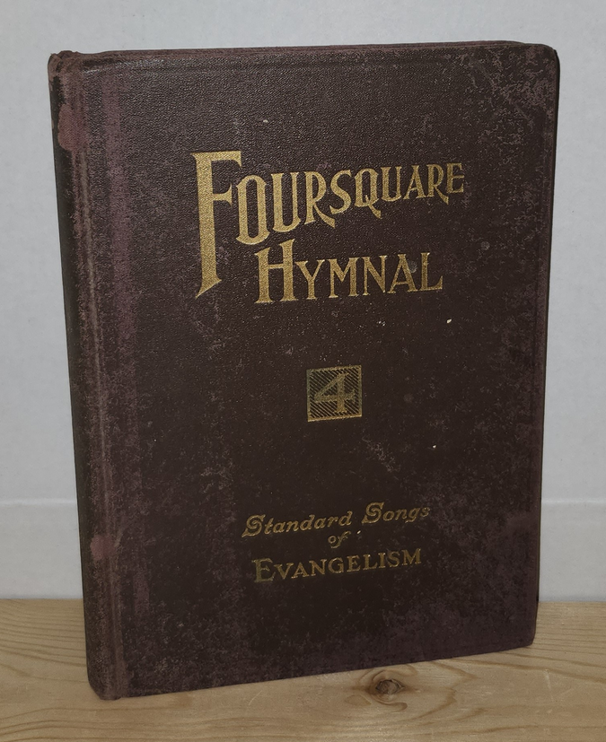
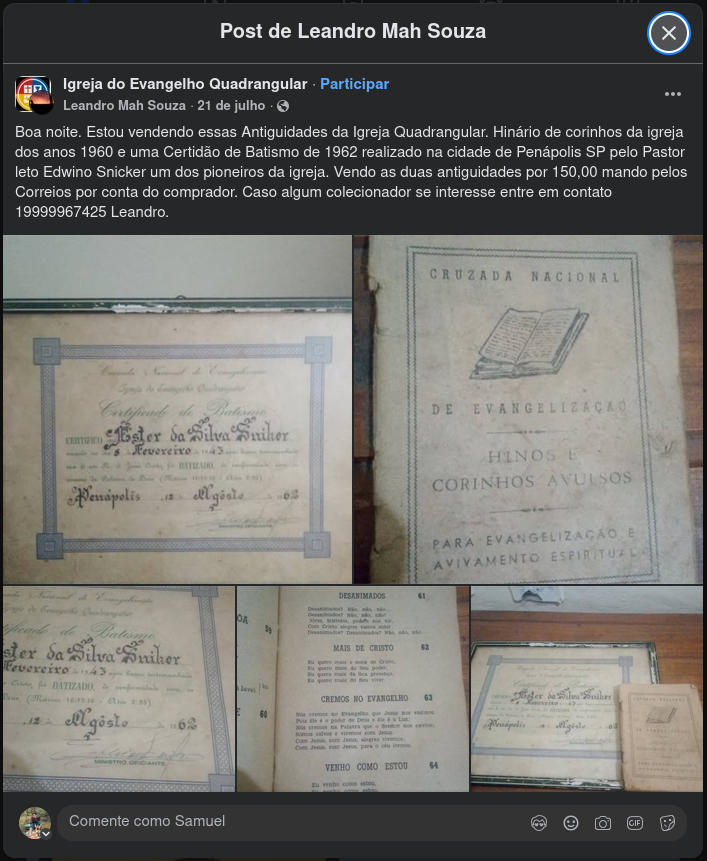
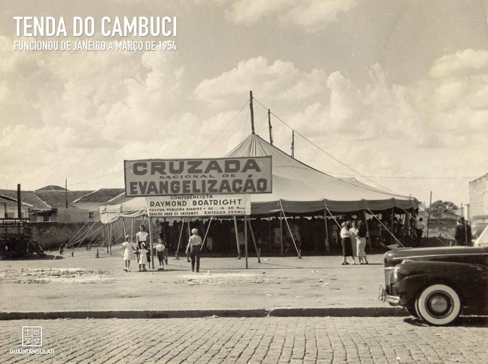

# Hinos e Corinhos Avulsos

Busca por livreto contendo os hinos ou corinhos que eram cantados no inicioa da Igreja do Evangelho Quadrangular no Brasil.
https://evangelhoquadrangular.com.br/sobre-hino-oficial/ Este site cita a existência desses hinários em português:

> A música e a letra do Hino Quadrangular são de autoria da fundadora da igreja, Aimée Semple McPherson. A tradução da letra foi feita por um dos pastores do início da obra no Brasil. A história do Hino conta com duas curiosidades: Ele foi publicado em 1955, só a partir da quarta edição do hinário oficial da Cruzada Nacional de Evangelização, departamento da IEQ entre os anos de 1952 e 1954. Na primeira tradução, constava a palavra “tendas” na segunda estrofe do hino. Recentemente, a palavra “tendas” foi substituída por “templos”.

- **Hinos e Corinhos Avulsos - 1952:** scan não localizado  
- **Hinos e Corinhos Avulsos - 1953:** scan não localizado  
- **Hinos e Corinhos Avulsos - 1954:** scan não localizado  
- **Hinos e Corinhos Avulsos - 1955:** scan não localizado

A principio minha hipótese é que o [FOURSQUARE HYMNAL OF STANDARD SONGS OF EVANGELISM](https://www.abebooks.com/FOURSQUARE-HYMNAL-STANDARD-SONGS-EVANGELISM-COMPILED/32421327602/bd) seja o maretial original. porém não foi encontrato nenhum scan ou foto pra fazer uma comparação, apenas um exemplar fisico sendo vendido por US$ 75.00 fora do Brasil. Por isso não tenho como confirmar nada ainda.



> FOURSQUARE HYMNAL OF STANDARD SONGS OF EVANGELISM. COMPILED FROM EDITORIAL SUGGESTIONS SUBMITTED BY 136 ACTIVE EVANGELISTS AND EVANGELISTIC MUSIC DIRECTORS. _Published by Los Angles, CA: Aimee Semple McPherson Publishing Co., 1942._

Quanto ao **Hinos e Corinhos Avulsos** encontrei um exemplar físico sendo vendido no facebook por R$ 150,00 junto de um certificado de batizmo de 1962 em https://www.facebook.com/share/p/1b9SSRJKdE/



> CRUZADA NACIONAL DE EVANGELIZAÇÃO - HINOS E CORINHOS AVULSOS - PARA EVANGELIZAÇÃO E AVIVAMENTO ESPIRITUAL 

**Atenção!** Um corinho que foi um "hit" nas igrejas baianas nos anos 70 pode nunca ter sido cantado na sede da Quadrangular em São Paulo nos anos 50. Essa regionalização é linda e tem muito valor cultural, mas de fato foge do escopo de resgatar as **raízes institucionais** originais da denominação.
É exatamente por tudo isso que o livreto da Cruzada Nacional de Evangelização tem tanto valor histórico. Ele elimina o achismo. Ele é o documento oficial, impresso pela própria instituição no calor do avivamento da época.



---

### HINOS E CORINHOS AVULSOS

> **⚠️ NOTA DE PRESERVAÇÃO HISTÓRICA:** 
> No exemplar físico original utilizado para esta digitalização, as folhas correspondentes ao final do cânticos 100 ao 109 foram perdidas pela ação do tempo e uso. O registro avança diretamente para o número 110.

- **101.** Oh, Igreja Apostólica, ide avante
- **102.** Desde o dia em que aceitei Jesus
- **103.** A minh'alma está cheia de paz
- **104.** O anjo do Senhor, o anjo do Senhor
- **105.** Filho meu, dá-me o teu coração
- **106.** Eu sou "cruzado"
- **107.** Bem de manhã o Senhor está conosco
- **108.** Muitas vezes sou tentado, mas
- **109.** Envia o teu poder

#### 62. MAIS DE CRISTO 
- https://www.youtube.com/watch?v=_UUqU5hCTEk&t
- Não confundir com o hino 152 do Foursquare Hymnal de 1957, pois este é outra melodia e outra letra, somente o título é parecido.
```
Eu quero mais e mais de Cristo,
Eu quero mais o seu poder,
Eu quero mais da sua presença, 
Eu quero mais do seu viver.
```

#### 110. O MUNDO AGORA ESTÁ DE PARABÉNS
- https://music.youtube.com/watch?v=HaPAr69Bi3E
```
O mundo agora está de parabéns, 
Porque um novo povo Deus levantou, 
Anunciando que Jesus em breve vem 
E está tirando todo pecado e dôr 
E os demônios são expulsos também 
Por êste povo que Deus levantou; 
E o poder do alto céu vem hoje, vem, 
Vem confirmar que Jesus já operou.

Confessa, confessa Que Jesus Cristo hoje te libertou } bis
```

#### 112. EU TENHO UM AMIGO QUE ME AMA
- https://music.youtube.com/watch?v=AWVIVcvBecY
```
Eu tenho um amigo que ama
Me ama, me ama.
Eu tenho um amigo que ama
Seu nome é Jesus
```

#### 179. QUEM DA COM ALEGRIA
- https://music.youtube.com/watch?v=D3hcgSSt95c
```
1. Quem dá com alegria como o sol brilhará.
   como o sol brilhará, como o sol brilhará.
   Quem dá com alegria como o sol brilhará.
   e Deus recompensará.

2. Quem ora sempre, sempre...

3. Quem prega o Evangelho...
```

#### 185. NUNCA MAIS DEIXAREI JESUS
- https://music.youtube.com/watch?v=WSWyA3pSg9M
```
Nunca mais, nunca mais deixarei Jesus 
Nunca mais, nunca mais deixarei a cruz. 
Eu tenho a certeza no meu coração 
De ao chegar no céu, receber meu galardão.
```
